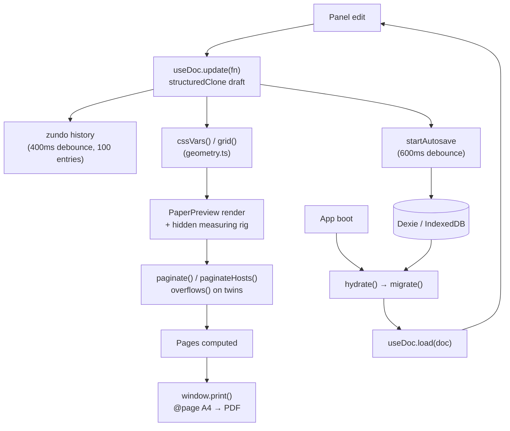

# Research Highlight Builder — Project Overview

A browser-only WYSIWYG tool for building **1–2 page A4 research highlights** for
the USM School of Physics. It is deliberately **not** an academic paper editor and
**not** Word: it produces a fixed, print-ready poster/spread, exported straight to
PDF through the browser's own print pipeline.

- **Live:** hosted on GitHub Pages.
- **No backend.** Everything runs client-side; a saved document is a self-contained
  JSON (images embedded as data URLs).

---

## 1. Stack

| Layer | Choice |
|-------|--------|
| UI | React 19 + Vite 8 + TypeScript |
| State | Zustand 5 (store) + zundo (undo/redo history) |
| Persistence | Dexie (IndexedDB) — local autosave, no server |
| Tests | Vitest + jsdom |
| Lint | oxlint |
| Fonts | Playfair Display bundled as `.woff2`; other families web-safe/system |

Scripts: `npm run dev` · `npm run build` (`tsc -b && vite build`) · `npm test`
(`vitest run`) · `npm run lint` (`oxlint`).

---

## 2. Non-negotiable rules (from `CLAUDE.md`)

These are load-bearing constraints. Breaking them silently breaks the layout:

1. **Column width is identical on every page.** Computed once in `lib/geometry.ts`.
   Page 1 = body columns + 1 sidebar column. Page 2 = the sidebar slot becomes a
   text column. **Never** set a different `column-count` per page.
2. **Multi-column overflow is detected on BOTH axes.** In a fixed-height
   multi-column box, `scrollWidth > clientWidth` catches sideways spill — but when
   a `column-span: all` element (a `body`/`bleed` figure) sits inside, the box
   breaks into stacked column-rows and overflow goes **downward** instead, which
   only `scrollHeight` sees. `overflows()` reads both. Don't drop either axis.
3. **`Doc.blocks` is linear.** Pages are *computed*, never stored.
4. **Figures anchor to a paragraph, never to coordinates.**
5. **`paper/` must not import anything from `panel/`.**
6. **Body text is left-aligned, not justified** by default (a 40 mm column +
   justify = rivers of whitespace).
7. **Drop cap uses `::first-letter`,** not a separate element.
8. **jsdom does not compute layout** — `scrollWidth` is always 0 there. Tests for
   `paginate()` must **inject** an `isOverflowing` parameter, never measure the DOM.
9. Do not rewrite `src/lib/paginate.ts`, `src/lib/geometry.ts`,
   `src/schema/document.ts`, or `src/store/useDoc.ts` without an explicit request.

---

## 3. Data model (`src/schema/document.ts`)

A document is one flat, serializable object. The renderer derives pages from it.

```
Doc
├─ schemaVersion         number (SCHEMA_VERSION = 1)
├─ templateId            'paper-1|2|3' | 'magazine-1|2|3' | 'gallery-1|2'
├─ meta                  masthead, title, subtitle, categoryLabel, author,
│                        affiliation, volume, location, photoCredit, pullQuote,
│                        pullQuoteBy, heroCaption …
├─ blocks: Block[]       linear content stream
├─ highlights: string[]  bullet items for the sidebar/highlights box
├─ references: Reference[]  structured (authors/title/journal/year/doi) — NOT free text
├─ hero                  { assetId|null, offsetX, offsetY, scale }  page-2 hero photo
├─ cover?               { assetId|null, offsetX, offsetY, scale }  page-1 cover photo
│                        (magazine-1/-3 only; absent = fall back to hero)
├─ assets               Record<id, { src(dataURL), naturalWidth, naturalHeight }>
└─ design: Design        layout + typography tokens (see §5)
```

**Block** is a discriminated union:

- `{ type: 'paragraph', text }` — text carries inline `**bold**`, `*italic*`,
  `__underline__` markup (parsed by `lib/richtext.ts`).
- `{ type: 'figure', assetId, caption, span, align?, frame? }`
  - `span`: `1` (one column), `'body'` (full body width), `'bleed'` (full width
    carried past the margin to the sheet edge). All still anchor to a paragraph.
  - `frame`: `{ scale, offsetX, offsetY }` — zoom/pan the image inside its box
    without resizing the box. Used by the gallery tiles.

`familyOf(id)` derives the layout engine from the id prefix; the family is never
stored. `migrate()` upgrades older saved docs. `emptyDoc()` seeds a blank doc.

---

## 4. Templates

Three **families** (= three layout engines), each with several **presets**
(content + design tokens). Registered in `src/store/presets.ts` (`TEMPLATES`);
`switchTemplate(id)` loads a preset instantly.

### Paper family — academic research highlight
| id | name | notes |
|----|------|-------|
| `paper-1` | Academic Journal | Base sheet: header + hero, 3 body columns + highlights rail. |
| `paper-2` | Physics Letter | Sheet 1 split into two text regions (beside the header, then under the hero) → breaks across 3 hosts. Has a top **bar** (`barColor`/`barTagColor`/`barTagInk`). |
| `paper-3` | Quantum Monograph | A hero **band** eats a different slice of sheets 1, 2, and 3+ → 3 measuring hosts. |

### Magazine family — editorial
| id | name | notes |
|----|------|-------|
| `magazine-1` | Modern Editorial | Full-bleed photo cover (page 1) + 2-column article; highlights as a band below the article, no ref labels, raw byline. |
| `magazine-2` | Particle Feature | One photo split across sheets 1–2 (`MagSplitCover` + `MagPhotoPage`); sheet 1 also carries the pull-quote + a highlights box. |
| `magazine-3` | Cosmos Spread | Same cover+spread engine as magazine-1. |

**Cover vs hero:** `magazine-1`/`-3` use **two separate images** — `doc.cover`
(page-1 full-bleed cover, `MagazineCover`) and `doc.hero` (page-2 photo above the
article, `MagazineHead`). Presets seed each as its own asset, so replacing one
never touches the other. Other templates keep a single `hero`.

### Gallery family — fixed photo collage
A gallery is a **CSS grid, not a text flow**: no pagination, always exactly 2 A4
pages read as an open spread. `grid-template-areas` owns every slot; `doc.blocks`
fill them in order (figures → `img-*`/`fold`, paragraphs → `card-*`).

| id | name | notes |
|----|------|-------|
| `gallery-1` | Photo Spread | 5 photos + 5 text cards. **Horizontal fold** image across the top (top-right of page 1 → top-left of page 2). |
| `gallery-2` | Centre Fold | 7 photos + 4 text cards. **Vertical fold** image down the centre of the spread (inner column of page 1 → inner column of page 2). Ships a dark sheet to show off auto-contrast text. |

**The fold image** ("foto yang memotong halaman") is one asset painted as two
halves by `FoldCell`: the `` is 200% of the cell width, anchored at the fold
edge, both halves sharing one `frame`, with the zoom origin on the fold — so pan
and zoom move both sides identically and the seam always holds. The fold cell
bleeds to the sheet edge on the fold side so the two halves meet with no gutter.

**Gallery paper background + auto-contrast:** `design.paperBg` sets the sheet
colour (any colour, default white). `cssVars()` computes `--paper-ink` from the
background's WCAG relative luminance (`readableInk`, threshold ~0.4): **black ink
on light sheets, white on dark**. A muted description tone comes from
`color-mix(--paper-ink, --paper-bg)`. Titles, labels, and captions stay legible on
any colour. Image-overlay captions stay white (dark gradient scrim).

**Gallery alignment:** cards and captions read `--body-align`, so the Design
panel's Body-alignment control applies to galleries too (defaults to `left` for
the narrow collage columns, not the global `justify`).

---

## 5. Design tokens (`Design`) & geometry

`Design` holds every knob the panel exposes: `bodyCols` (2|3|4), `bodyAlign`,
`sidebar`, `highlightsPlacement` (`page1|all|below|page1-flow`), fonts
(`fontDisplay`, `fontBody`, per-element overrides), `colors`
(`hero/accent/accentSoft/ink`), `paperBg?`, bar colours, `margin`, `gutter`,
`heroHeight`, `sizes` (pt for each text role), and a `customCss` escape hatch.

`lib/geometry.ts` is the single source of layout truth:

- **`grid(design)`** — the invariant. Computes one column width shared by every
  page. A right rail is a separate sidebar column only when `sidebar` is on and
  placement is `page1`/`all`; `page1-flow` instead rides the flow as a one-column
  atom. Either way the highlights consume exactly one column, so the body column
  width is unchanged. Returns `col`, `body1/body2`, `cols1/cols2`, `rail`, etc.
- **`cssVars(design)`** — flattens everything into CSS custom properties
  (`--col`, `--body-1`, `--body-align`, `--paper-bg`, `--paper-ink`, `--fs-*`,
  font stacks …) fed to the page wrapper via `style={vars}`.
- **`cplWarning(design)`** — characters-per-line guardrail (<~35 = unreadable).
- Page constants: `PAGE_W = 210`, `PAGE_H = 297` (mm, A4).

---

## 6. Pagination engine (`src/lib/paginate.ts`)

Pure functions that decide where content breaks. **They never touch the real DOM
directly for layout maths** — a hidden *measuring rig* in `PaperPreview` renders
"twin" boxes identical to the real body columns, and the paginator asks whether a
twin overflows.

- **`overflows(el)`** = `scrollWidth > clientWidth+1 || scrollHeight > clientHeight+1`
  — reads both axes (see rule #2).
- **`FlowItem`** describes each block for measuring (text vs figure, aspect,
  caption, `full`/`bleed`). **`Piece`** is a placed fragment; **`Pagination`** =
  `{ pages, fill, spill }`.
- **`paginate(host1, host2, flow)`** — breaks the flow across a short first host
  (room reserved for the header/quote) and a plain host for later pages.
- **`paginateHosts([...], flow)`** — for templates whose sheet 1 spends several
  regions (paper-2's two regions, paper-3's band variants).
- **`fitMessage(pagination)`** → the `ok`/`warn`/`bad` fit badge in the toolbar.
- Galleries skip this entirely (fixed 2-page collage).
- **Testability:** because jsdom returns `scrollWidth = 0`, `paginate` tests inject
  an `isOverflowing` predicate instead of measuring (see `paginate.test.ts`).

---

## 7. Rendering pipeline (`src/paper/`)

`PaperPreview.tsx` is the conductor. It:

1. Builds `vars` from `cssVars` + measured header/hero heights.
2. Runs the measuring rig in a `useLayoutEffect`, choosing the right host plan per
   template (paper / paper-2 / paper-3 / magazine / magazine-2 / gallery).
3. Renders the real pages for the active family, plus preview chrome: a formatting
   bar (B/I/U), the fit badge, a **Spread** toggle (magazine + gallery), and a
   zoom control (Fit / manual %).

Per-family components (none import from `panel/`):

- Paper: `Page1`, `ContPage`, `PaperTwo`, `PaperThree*`, `Sidebar`, `TagBar`, `Flow`.
- Magazine: `MagazineCover`, `MagazineHead`, `MagazinePage`; split variant
  `MagSplitCover`, `MagSplitHead`, `MagPhotoPage`.
- Gallery: `GalleryPage` (branches to `GalleryTwo` for `gallery-2`), with shared
  cells `ImageCell`, `FoldCell`, `CardCell`, `Head`.
- `Flow.tsx` renders the block stream into columns; figure captions honour
  `block.align`.

Styles live in `src/styles/` (`page.css`, `magazine.css`, `gallery.css`,
`paper2.css`, `paper3.css`, `panel.css`, `fonts.css`).

---

## 8. State & undo (`src/store/useDoc.ts`)

- A single Zustand store holds `doc`. **Every edit goes through `update(fn)`**,
  which `structuredClone`s the doc, mutates the draft, and sets it (immutable swap).
- `load(doc)` replaces the doc; `switchTemplate(id)` loads `presetFor(id)`.
- Wrapped in **zundo `temporal`**: undo/redo with a 400 ms debounce (so a burst of
  keystrokes is one history entry) and a 100-entry limit. `useHistory()` exposes it.

---

## 9. Persistence (`src/store/persist.ts`, `db.ts`)

- **Dexie/IndexedDB**, local only. `saveDoc`/`loadDoc` in `db.ts`.
- `startAutosave(delay=600)` mirrors every store change to IndexedDB, debounced.
- `hydrate()` loads the saved doc on boot and runs `migrate()`; returns
  `restored | empty | error`. On a read error it deliberately does **not** clobber
  the stored doc with an empty autosave.
- Image uploads are validated/loaded via `lib/loadImage.ts` (`loadImage`,
  `ImageLoadError`) with user-facing error messages in the Hero panel.
- Save status surfaced through `store/saveStatus.ts`.

---

## 10. Editor panel (`src/panel/`)

`Panel.tsx` — left sidebar. A **template switcher** (paper / magazine / gallery
accordions) plus four tabs:

- **Content** → `MetaSection` + `BodySection` (paragraphs, figures, span, align).
- **Images** → `GallerySection` for galleries (per-template image slots: 5 for
  gallery-1 with the fold at slot 1; 7 for gallery-2 with the fold at slot 0; plus
  a paper-background colour picker), otherwise `HeroSection` (cover + hero pickers
  for magazine-1/-3, single hero elsewhere, framing + hero height).
- **Highlights** → `HighlightsSection` + `ReferencesSection` (with a count badge).
- **Design** → `DesignSection` (columns, alignment, fonts, sizes, colours, bars,
  custom CSS).

Shared field widgets in `Field.tsx` (`LabeledColor`, `LabeledRange`,
`LabeledNumber`, `LabeledSelect`, `SegmentField`, `Section`). `Toolbar.tsx` and
`lib/activeEditor.ts` drive the B/I/U formatting of the focused textarea.

---

## 11. Export to PDF

`window.print()` + `@page { size: A4; margin: 0 }` + `print-color-adjust: exact`.

- **Do not** use `@react-pdf/renderer` (no `column-count` support).
- **Do not** use `html2canvas` (rasterises the PDF).
- Every coloured band/scrim sets `print-color-adjust: exact` so it survives print.

---

## 12. Directory map

```
src/
├─ schema/document.ts     Doc/Block/Design/Meta/Reference types, emptyDoc, migrate, familyOf
├─ lib/
│  ├─ geometry.ts         grid() invariant, cssVars(), readableInk(), cplWarning()
│  ├─ paginate.ts         overflows(), paginate(), paginateHosts(), fitMessage()
│  ├─ richtext.ts         **bold**/*italic*/__underline__ parser
│  ├─ activeEditor.ts     apply B/I/U to the focused textarea
│  ├─ loadImage.ts        validated image upload → data URL
│  ├─ magSplit.ts         magazine-2 photo-strip geometry
│  └─ paper2.ts / paper3.ts   per-template grid maths
├─ paper/                 all render components (must not import panel/)
├─ panel/                 editor UI (Panel, tabs, sections, Field widgets)
├─ store/
│  ├─ useDoc.ts           Zustand + zundo store
│  ├─ presets.ts          TEMPLATES registry + paper/magazine presets & placeholder art
│  ├─ gallery.ts          gallery-1 / gallery-2 presets + SVG placeholder photos
│  ├─ persist.ts / db.ts  Dexie autosave + hydrate + migrate
│  └─ saveStatus.ts
├─ styles/                per-family CSS
└─ sample.ts              default sample document (paper-1)
```

Tests sit next to their subjects: `paginate.test.ts`, `richtext.test.ts`,
`loadImage.test.ts`, `persist.test.ts`, `template.smoke.test.ts`.

---

## 13. Workflow conventions

- **One PR per section.** Conventional Commits.
- Run `npx tsc --noEmit` before committing.
- Optional-with-fallback is the migration pattern: new `Design`/`Doc` fields are
  optional and default to the old behaviour, so previously saved documents render
  unchanged (`bodyAlign`, `paperBg`, `cover`, figure `frame`/`align`, per-element
  fonts, bar colours all follow this).

---

## 14. Known issues / notes

- **Safari PDF export** can fragment the output; Chromium-based browsers export
  cleanly. Recommend Chrome/Edge for the final PDF.
- UI copy is English; some magazine **preset content** is sample Indonesian prose
  (placeholder — meant to be replaced by the author).
- Placeholder photos are inline SVG data URLs, so every preset is self-contained
  with no external files.

---

## 15. Glossary

| Term | Meaning |
|------|---------|
| **Fold** | The image that crosses the page boundary of a spread. One asset painted as two halves by `FoldCell` (page 1 inner edge → page 2 inner edge), bleeding to the seam so the halves meet with no gutter. Horizontal in gallery-1, vertical in gallery-2. |
| **Spanner** | A `column-span: all` figure (`span: 'body'`/`'bleed'`). It breaks a multi-column box into stacked column-rows, so overflow spills **downward** — why `overflows()` must read `scrollHeight`, not just `scrollWidth`. |
| **Rail** | A separate sidebar column reserved for highlights/references. Computed in `grid()`; present when `sidebar` is on and `highlightsPlacement` is `page1`/`all`. |
| **Host / twin / measuring rig** | Hidden boxes in `PaperPreview`, sized identically to the real body columns. The paginator measures a *twin* (not the visible page) to decide where the flow breaks. |
| **Bleed** | A `span: 'bleed'` figure carried past the page margin out to the sheet edge. |
| **Drop cap** | The oversized first letter of a body paragraph, done with `::first-letter` (never a separate element). |
| **Kicker / eyebrow** | The small `categoryLabel` line above the title. |
| **Masthead** | The publication name/logo on a magazine cover and spread header (e.g. "KUANTA"). |
| **Folio** | The page-number footer (e.g. `001`). |
| **Fit badge** | Toolbar indicator (`ok`/`warn`/`bad`) from `fitMessage()`, showing whether the content fits the sheets. |
| **Spread** | Two A4 sheets shown side by side (an open magazine/gallery). A view-only toggle — it never changes pagination or the PDF. |

---

## 16. Deploy (GitHub Pages)

- Static hosting only — no backend, no build-time data.
- `vite.config.ts` sets `base` conditionally: `/research-highlight-builder/` on
  `build` (the Pages project subpath), `/` on the dev server.
- `npm run build` → `dist/`, which is published to GitHub Pages.
- Because the whole app is client-side and a saved doc embeds its own images, the
  deployed site needs no storage service; documents live in the visitor's own
  IndexedDB.

---

## 17. Design-decision rationale (the "why")

| Decision | Reason |
|----------|--------|
| Body text left-aligned by default | A ~40 mm column + `justify` = rivers of whitespace. |
| Same column width on every page | Different `column-count` per page makes the pages stop looking like one document. |
| `overflows()` reads **both** axes | A spanner turns sideways overflow into downward overflow; `scrollWidth` alone goes blind. |
| `Doc.blocks` linear, pages **computed** | Reflow stays correct when the template, body size, or column count changes. |
| Figures anchor to a paragraph, not coordinates | On reflow there are no orphaned free-floating images to fix up. |
| `window.print()` for PDF | `@react-pdf/renderer` has no `column-count`; `html2canvas` rasterises the output. Native print keeps real, selectable, multi-column text. |
| `paper/` must not import `panel/` | Keeps the renderer print-pure and independent of the editor UI. |
| New fields optional with a fallback | Previously saved documents keep their exact look (`bodyAlign`, `paperBg`, `cover`, figure `frame`/`align`, per-element fonts, bar colours). |

---

## 18. Data flow


